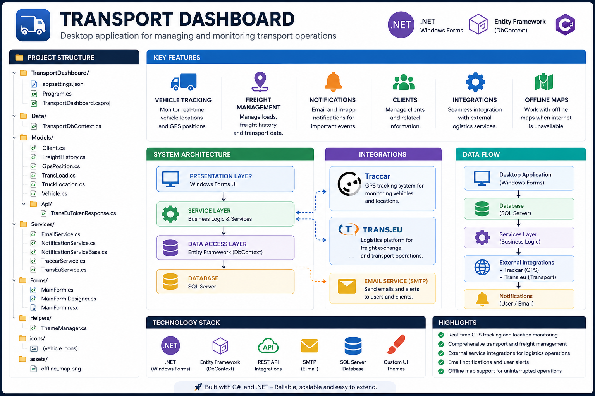
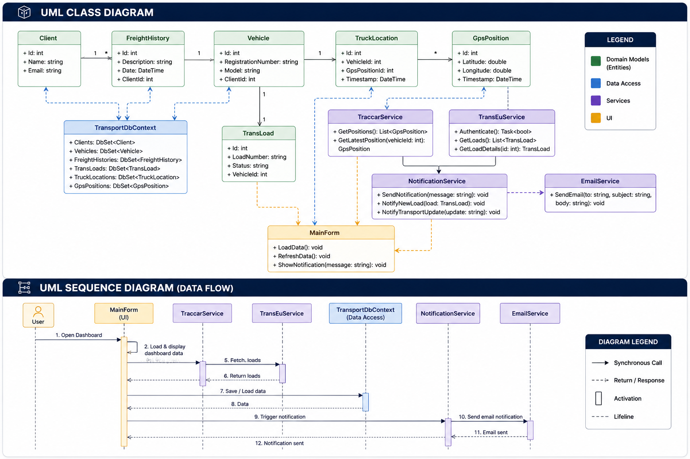

# 🚚 Transport Dashboard

A desktop application for managing and monitoring transport operations, including vehicle tracking, freight history, and integrations with external logistics services.



## UML CLASS DIAGRAM




## 📌 Features

- 🚛 Vehicle tracking and GPS position monitoring
- 📦 Freight and transport history management
- 🔔 Notification system (email + internal)
- 🌍 Integration with external services:
  - Traccar (GPS tracking)
  - Trans.eu (logistics platform)
- 🗺️ Offline map support
- 🎨 Custom UI themes

## 🏗️ Project Structure
```
TransportDashboard/
├── Data/ # Database context
├── Models/ # Domain models and API DTOs
├── Services/ # Business logic and integrations
├── Forms/ # Windows Forms UI
├── Helpers/ # Utility classes
├── icons/ # UI icons
```

## ⚙️ Technologies

- .NET (Windows Forms)
- Entity Framework (DbContext)
- REST API integrations
- SMTP (Email notifications)

## 🚀 Getting Started

### Requirements

- .NET SDK
- Visual Studio (recommended)

### Installation

```bash
git clone https://github.com/mmazurek-IntSys/transport-dashboard.git
cd transport-dashboard

## Open the solution in Visual Studio and run:
dotnet build
dotnet run
```
## 🔧 Configuration

Edit the appsettings.json file:
```
{
  "ConnectionStrings": {
    "DefaultConnection": "your_database_connection"
  },
  "Email": {
    "SmtpServer": "your_smtp",
    "Port": 587,
    "Username": "your_email",
    "Password": "your_password"
  },
  "TransEu": {
    "ApiUrl": "...",
    "ClientId": "...",
    "ClientSecret": "..."
  }
}
```

## Integrations
Traccar

Used for GPS tracking and vehicle positioning.

Trans.eu

Used for freight exchange and logistics operations.

##Future Improvements

Web version (ASP.NET / Blazor)
Real-time tracking dashboard
Advanced analytics & reporting
Mobile app integration

## 🤝 Contributing

Pull requests are welcome. For major changes, please open an issue first.


